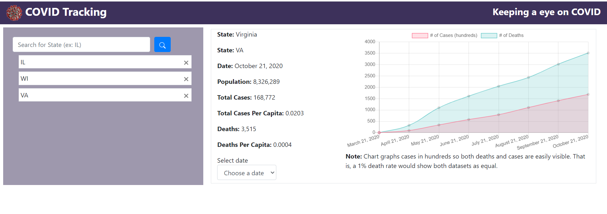

# Covid Tracking 
## Table of Contents 
 * [About](#About) 
 * [Installation](#Installation) 
 * [Usage](#Usage) 
 * [Contributing](#Contributing) 
 * [License](#License) 
  
## About 
 In this website we provide the user with the ability to search for and find covid data for each of the states in the United States of America.  By putting in which state they want to look at, they will be able to see the current data as well as the historical data over the last 7 months.  This will allow for people to more easily examine the data for themselves instead of taking summaries from other sources. 
  
## Installation 
 1. Clone this repository at [GitHub](https://github.com/jalbert12485/covid-tracking.git) 
```sh 
git clone https://github.com/jalbert12485/covid-tracking.git
 ``` 
2. Install packages using 
```sh 
npm i
 ``` 
 
## Usage 
 In order to use this project as a user, you need only open the index.html in a browser.  There, you will have a search bar to input the state of your choice (using the 2 letter abbreviation) and a date toggle so that you can view data from different dates. 
## Contributing 
 If you would like to contribute to this package, please contact the author via [email](mailto:jalbert@carthage.edu).  Provide any details about your proposed chagnes so that your contribution can be made. 
## License 
 MIT License 
 
 Permission is hereby granted, free of charge, to any person obtaining a copy of this software and associated documentation files (the /'Software/'), to deal in the Software without restriction, including without limitation the rights to use, copy, modify, merge, publish, distribute, sublicense, and/or sell copies of the Software, and to permit persons to whom the Software is furnished to do so, subject to the following conditions: 
 
 The above copyright notice and this permission notice shall be included in all copies or substantial portions of the Software.  
  
 THE SOFTWARE IS PROVIDED 'AS IS', WITHOUT WARRANTY OF ANY KIND, EXPRESS OR IMPLIED, INCLUDING BUT NOT LIMITED TO THE WARRANTIES OF MERCHANTABILITY, FITNESS FOR A PARTICULAR PURPOSE AND NONINFRINGEMENT. IN NO EVENT SHALL THE AUTHORS OR COPYRIGHT HOLDERS BE LIABLE FOR ANY CLAIM, DAMAGES OR OTHER LIABILITY, WHETHER IN AN ACTION OF CONTRACT, TORT OR OTHERWISE, ARISING FROM,  OUT OF OR IN CONNECTION WITH THE SOFTWARE OR THE USE OR OTHER DEALINGS IN THE SOFTWARE. 
